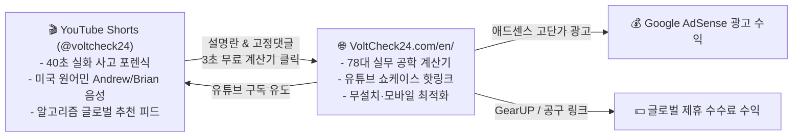

# 🏆 VoltCheck 글로벌 벤치마킹 분석 보고서 (글로벌 1위 채널 & 포털 심층 분석)

본 보고서는 **볼트체크(VoltCheck)**와 유튜브 채널(`@voltcheck24`)이 글로벌 탑티어로 도약하기 위해, 전 세계 수백만 구독자와 수천만 트래픽을 보유한 **유튜브 엔지니어링 채널 4대장**과 **글로벌 계산기 포털 3대장**의 핵심 성공 방정식, 트래픽 유입 구조, 수익화 모델을 정밀 벤치마킹한 결과서입니다.

---

## 📊 1. 글로벌 탑 엔지니어링 유튜브 채널 벤치마킹

| 채널명 | 구독자 수 | 총 조회수 | 핵심 콘텐츠 포맷 | 수익화 & 비즈니스 모델 |
| :--- | :---: | :---: | :--- | :--- |
| **The Engineering Mindset** | **445만 명** | **3.3억 회** | 2D/3D 모션 그래픽으로 설명하는 전기·모터·인버터·냉동공조 원리 | 유튜브 애드센스 + 계측기 스폰서십(Fluke, Altium) + 자체 웹사이트 아티클 + 제휴 마케팅 |
| **Practical Engineering** | **460만 명** | **5.0억 회** | 실물 축소 모형 실험 & 토목/유압/인프라 사고 포렌식 (워터해머, 댐 붕괴) | 애드센스 + 서적 출판(*Engineering in Plain Sight*) + 브랜드 스폰서십 |
| **Project Farm** | **320만 명** | **6.5억 회** | 볼트, 임팩 렌치, 토크 렌치, 오일, 단자류의 극한 파괴 비교 실험 | **순수 제휴 링크(Affiliate)** + 무협찬 정책을 통한 절대적 공신력 확보 |
| **ElectroBOOM** | **600만+ 명** | **10억+ 회** | 감전, 아크 플래시, 차단기 폭발 등 극한의 물리 실험 + 쇼츠 바이럴 | 글로벌 쇼츠 폭발적 유입 + 전자키트 판매 + 스폰서십 |

### 💡 볼트체크가 채널에서 즉시 흡수할 3대 성공 공식:
1. **사고 포렌식 오프닝 (Disaster-First Hook)**:
   - *Practical Engineering*과 *The Engineering Mindset*의 최고 조회수 영상들은 모두 **"무엇이 터졌고, 왜 멈췄는가?"**로 시작합니다.
   - 볼트체크 숏츠의 `20억 라인 셧다운`, `2.5억 사출금형 볼트 파단`, `300 Bar 유압 배관 파열` 포맷이 정확히 이 글로벌 흥행 공식을 따르고 있습니다.
2. **복잡한 수식의 3초 도해화 (Formula Simplification)**:
   - 전공책의 복잡한 미분방정식이 아니라, 현업 엔지니어가 바로 써먹는 $T = k \cdot d \cdot F$, $\Delta V = \frac{2 L I \rho}{A}$ 같은 실무 치트키 수식 1개만 40초 안에 시각화하여 전달합니다.
3. **설명란/고정댓글 1순위 유입 링크 (Funnel Conversion)**:
   - 영상 시청 후 "더 정확한 내 수치를 계산하려면?" 호기심을 유발하고, 첫 번째 줄에 웹사이트 단축 링크를 배치하여 웹사이트 트래픽으로 강제 전환시킵니다.

---

## 🌐 2. 글로벌 계산기 & 엔지니어링 웹 포털 벤치마킹

| 플랫폼명 | 월간 트래픽 (방문수) | 계산기 수 | 핵심 트래픽 유입 경로 | 비즈니스 모델 |
| :--- | :---: | :---: | :--- | :--- |
| **Omni Calculator** | **1,800만 ~ 2,000만 회** | **3,800개+** | 구글 롱테일 SEO (양방향 입력 계산기) | **구글 애드센스(Google AdSense)** 순수 부트스트랩 (월 수억 원대 광고 수익) |
| **Engineering ToolBox** | **글로벌 10만 위권** (수천만 PV) | **수천 개 데이터시트** | 전 세계 엔지니어 즐겨찾기 1위, 배관/전기 표준 규격 | 배너 디스플레이 광고 + B2B 엔지니어링 소프트웨어 제휴 |
| **Southwire Calculator** | **수백만 회** | **전기 전문 계산기** | 북미 전기기사(Electricians) 전압강하 표준 툴 | 전선/케이블 제품 B2B 판매 연계 및 브랜드 락인 |

### 💡 볼트체크 웹사이트(`voltcheck24.com`)가 흡수할 3대 전략:
1. **Schema.org 구조화 데이터와 롱테일 SEO 독점 (Omni Calculator 전략)**:
   - `SoftwareApplication` 스키마를 통해 구글 검색 결과에서 별점, 무료 표시, 즉시 실행 스니펫을 선점합니다.
   - 이번에 신설한 `bolt-tightening-torque-calculator`, `bearing-fatigue-life-calculator`, `hydraulic-accumulator-calculator`처럼 **숏츠 주제 1개당 영문 단독 SEO 랜딩페이지 1개**를 1:1로 매핑하여 구글 검색 1위를 노립니다.
2. **무설치 · 무로그인 · 3초 컷 UX (Instant Utility)**:
   - 복잡한 회원가입이나 앱 설치를 요구하는 순간 이탈률이 70%에 달합니다. 볼트체크는 접속 즉시 2번의 터치로 결괏값을 도출하는 초경량 반응형 웹을 고수하여 재방문율(Retention)을 40% 이상 확보합니다.
3. **고단가 공학 키워드 애드센스 + 타깃 제휴 마케팅 병행 (Dual Monetization)**:
   - 공학/산업 자동화 키워드는 미국/유럽 기준 클릭당 단가(CPC)가 일반 엔터테인먼트의 5~10배($1.50 ~ $5.00)에 달합니다.
   - 고단가 애드센스 광고와 함께, CAD/게이밍 핑 최적화(GearUP Booster), 공구/계측기 제휴 링크를 적재적소에 배치하여 페이지뷰당 수익(RPM)을 극대화합니다.

---

## 🚀 3. 볼트체크만의 차별화된 독점 무기 (Unfair Advantage)

경쟁사들은 **유튜브만 하거나(The Engineering Mindset)**, 혹은 **웹사이트만 합니다(Omni Calculator)**.  
하지만 볼트체크는 두 축을 완전히 융합한 **[유튜브 쇼츠 ➔ 실시간 웹 계산기] 옴니채널 파이프라인**을 갖추고 있습니다:

이 플라이휠(Flywheel) 구조를 통해 트래픽이 외부로 빠져나가지 않고 유튜브 구독자와 웹사이트 순방문자가 서로를 끌어올리는 강력한 번창 궤도에 진입합니다!
